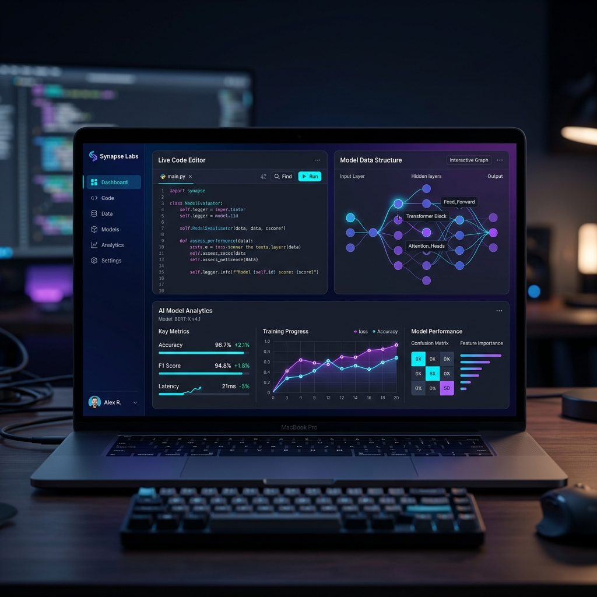
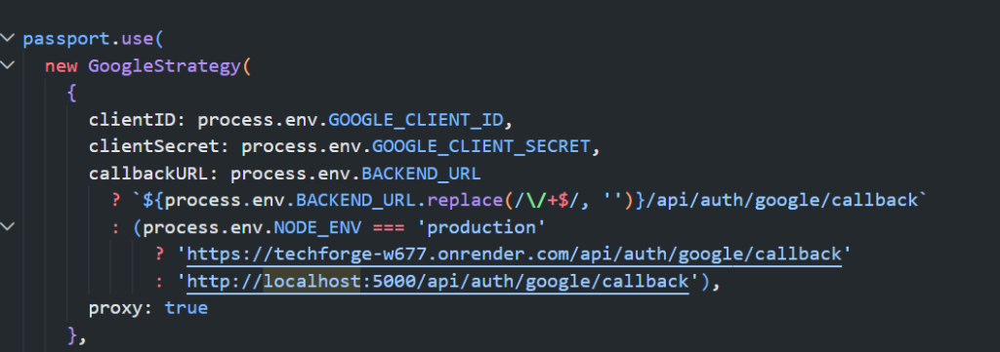
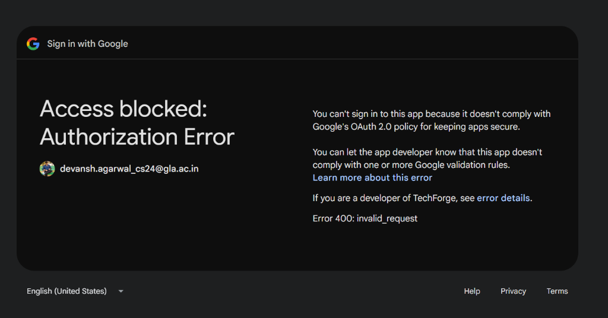

#  TechForge

[](https://tech-forge-zeta.vercel.app)
[](https://nodejs.org)
[](https://react.dev)
[](https://tailwindcss.com)

**TechForge** is a premium, production-ready, full-stack AI-powered career and technical interview preparation platform. It enables candidates to master their technical interviewing skills through interactive voice mock interviews, automated resume ATS scoring, interactive DSA practice, and real-time daily coding challenges with global rankings.

🚀 **Explore the Live App:** [https://tech-forge-zeta.vercel.app](https://tech-forge-zeta.vercel.app)

---

## 📸 Platform Showcase

### Interactive Dashboard & Analytics


### Coding & Practice Rooms


### Modern Workspace Panel


---

## ✨ Features

- **🗣️ AI Verbal Mock Interviews**: Verbal response tracking via web voice recognition, delivering precise OpenAI evaluations, transcriptions, and actionable feedback metrics.
- **📄 Resume ATS Optimizer**: Instantly scan and score resumes against industry roles with detailed feedback reports on impact, keyword match, formatting, and structural issues.
- **💻 DSA Practice & Tracking**: Log LeetCode-style coding practice sessions with progress charts, streak indicators, and multi-language solution stubs.
- **🏆 Live Daily Challenges**: Solve algorithmic puzzles in JavaScript, Python, Java, C++, or C directly in a custom VS Code-style interactive console with a step-by-step compiling terminal.
- **⚡ Interactive Gamification**: Real-time streaks, custom neon achievements, and a live global Leaderboard to spark competitive learning.

---

## 🌀 High-Fidelity Animations & Interaction

TechForge features a rich, responsive interface designed to feel alive and premium:
- **Google Antigravity Particles**: A custom canvas-based background (`BackgroundParticles.jsx`) with realistic friction and inertia. Particles respond dynamically to mouse coordinates with proximity attraction, tanget orbital swirling, and center repulsion. Includes active culling to keep CPU usage low.
- **Framer Motion Transitions**: Smooth page transitions, micro-interactive list layouts, slide-up compiling console panels, and responsive modal overlays (Pricing, About Us, Contacts, Privacy).
- **Dual Theme Support**: Beautiful CSS variable system backing seamless dark mode and light mode color changes.

---

## 🛠️ Technology Stack

| Layer | Technologies |
| :--- | :--- |
| **Frontend** | React 19 (Vite), Framer Motion, Tailwind CSS, Recharts, Lucide React, Axios, Context API |
| **Backend** | Node.js, Express.js (MVC), Passport.js, JWT, Helmet, Express-Rate-Limit |
| **Database & Storage** | MongoDB, Mongoose, Multer, Cloudinary Stream API |
| **AI & Mail Services** | OpenAI API (Structured JSON parsing), Nodemailer SMTP |

---

## 📂 Project Structure

```
├── backend/
│   ├── config/             # DB, Cloudinary, and Passport configs
│   ├── controllers/        # Express API request controllers (MVC)
│   ├── middleware/         # Auth verification, rate limiting, and uploads
│   ├── models/             # Mongoose schemas
│   ├── routes/             # Express routing paths
│   ├── services/           # OpenAI prompt helpers and email dispatches
│   ├── .env.example        # Reference environment file
│   └── server.js           # Server startup script
│
├── frontend/
│   ├── public/             # Static assets, redirects, and favicon
│   ├── src/
│   │   ├── components/     # Canvas particles, layouts, and modals
│   │   ├── context/        # Session Auth and Theme contexts
│   │   ├── pages/          # Dashboard, Mocks, Resumes, and DSA pages
│   │   ├── utils/          # Axios HTTP clients and helper utilities
│   │   └── App.jsx         # App router switchboard
│   ├── vercel.json         # SPA router redirection mappings
│   └── package.json        # Frontend manifest
```

---

## 🚀 Local Development Setup

### Prerequisites
- **Node.js** (v18.0.0 or higher)
- **MongoDB** instance (local or Atlas cluster)

### 1. Setup Backend
1. Navigate to the backend folder:
   ```bash
   cd backend
   ```
2. Install dependencies:
   ```bash
   npm install
   ```
3. Create a `.env` file based on `.env.example` and fill in your custom environment configurations:
   ```bash
   cp .env.example .env
   ```
4. Start the server:
   ```bash
   npm run dev
   ```

### 2. Setup Frontend
1. Navigate to the frontend folder:
   ```bash
   cd ../frontend
   ```
2. Install dependencies:
   ```bash
   npm install
   ```
3. Create a `.env` file based on `.env.example` and fill in your client configuration:
   ```bash
   cp .env.example .env
   ```
4. Start the client:
   ```bash
   npm run dev
   ```

---

## 📡 REST API Routes

### Authentication
- `POST /api/auth/register` - Register standard credentials
- `POST /api/auth/login` - Sign in standard credentials
- `GET /api/auth/google` - Initiate Passport Google OAuth login flow
- `GET /api/auth/google/callback` - OAuth authorization code callback handler
- `GET /api/auth/profile` - Fetch current active session profile details

### Resume Analyzer
- `POST /api/resumes/upload` - Upload PDF resume for AI parsing and ATS scoring
- `GET /api/resumes/history` - Retrieve resume history list
- `GET /api/resumes/:id` - Fetch details of a single scan analysis report

### Mock Interviews
- `POST /api/interviews/generate` - Seed custom questions based on role filters
- `POST /api/interviews/sessions/:id/submit-answer` - Submit verbal response transcriptions
- `POST /api/interviews/sessions/:id/evaluate` - Finalize mock run and invoke OpenAI grader reports
- `GET /api/interviews/sessions` - List completed mock sessions list

### DSA & Challenges
- `GET /api/dsa/progress` - Fetch completed problem checklists
- `POST /api/dsa/progress` - Toggle problem completion status
- `GET /api/challenges/daily` - Retrieve active daily challenge items
- `POST /api/challenges/submit` - Validate submissions and log points
- `GET /api/leaderboard` - Fetch sorted global points list
