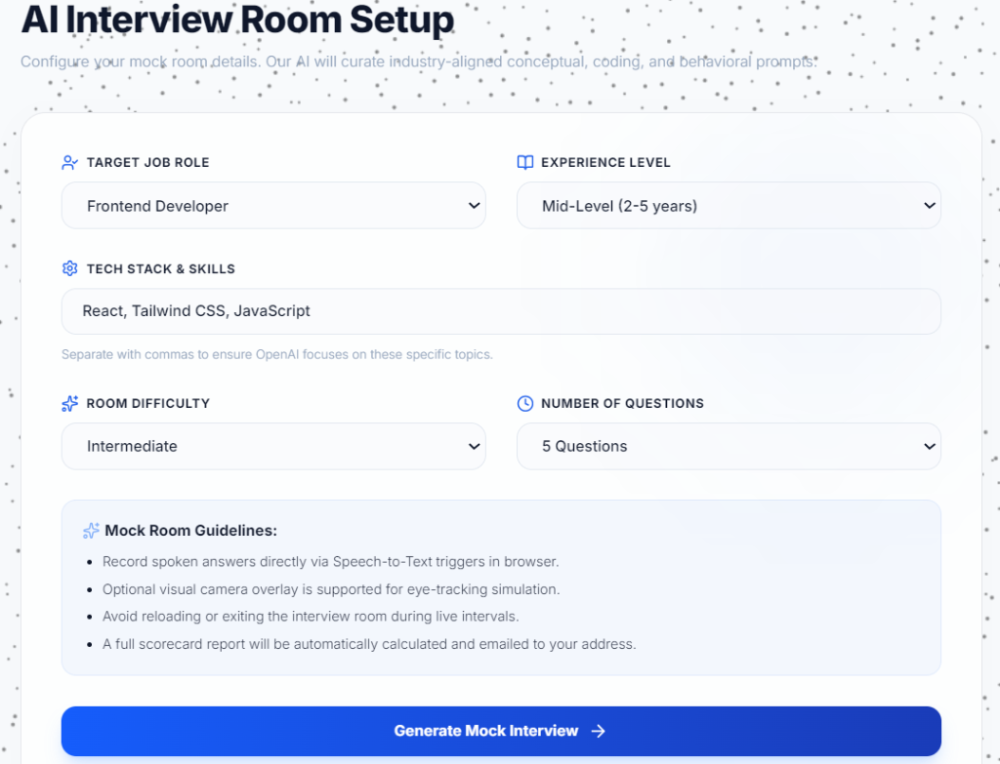
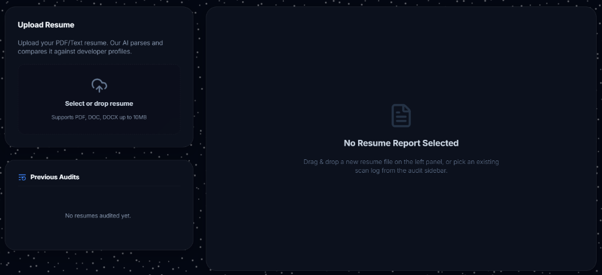
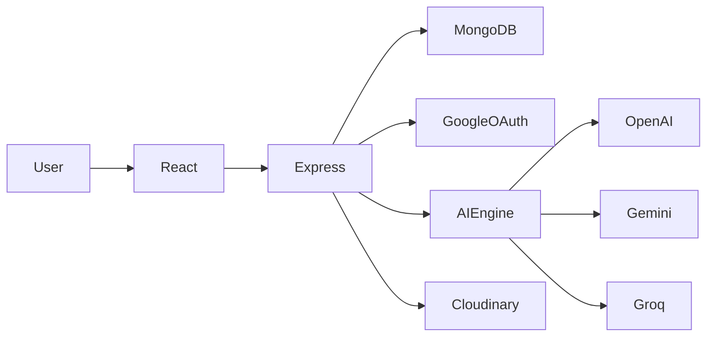

<div align="center">


# TalentForge AI

### The Future of Interview Preparation 🚀

AI-Powered Mock Interviews • Resume Intelligence • DSA Tracking • Career Guidance


<p align="center">

Built to help students prepare smarter, track progress, improve resumes, and crack interviews using AI.

</p>

</div>

---

## ✨ What is TalentForge?

TalentForge is an all-in-one AI-powered career preparation platform.

Instead of switching between multiple websites for interview prep, resume analysis, DSA tracking, and career guidance, TalentForge combines everything into a single modern experience.

---

## 🎯 Core Features

<table>
<tr>
<td align="center" width="33%">

### 🤖 AI Interviews

Generate role-specific interview questions.

</td>

<td align="center" width="33%">

### 📄 ATS Resume Scanner

Analyze resumes and identify missing skills.

</td>

<td align="center" width="33%">

### 🎤 Mock Interviews

Practice interviews with AI feedback.

</td>
</tr>

<tr>
<td align="center">

### 💻 DSA Tracker

Track coding progress topic-wise.

</td>

<td align="center">

### 📊 Analytics

Visualize growth and performance.

</td>

<td align="center">

### 🏆 Gamification

Challenges, streaks, XP, leaderboard.

</td>
</tr>
</table>

---

# 🖥 Preview

### Dashboard


### AI Mock Interview



### Resume Analysis



---

# ⚙ Architecture



---

# 🛠 Tech Stack

### Frontend

```txt
React.js
Tailwind CSS
Framer Motion
Axios
React Router
Recharts
```

### Backend

```txt
Node.js
Express.js
MongoDB
JWT
Google OAuth
Cloudinary
```

### AI Layer

```txt
OpenAI
Gemini
Groq
```

---

# 🚀 Quick Start

```bash
git clone https://github.com/Dev0ps404/TalentForge-AI.git

cd TalentForge-AI

npm install
```

Frontend

```bash
cd client
npm run dev
```

Backend

```bash
cd server
npm run dev
```

---

# 🔐 Environment Variables

```env
PORT=5000

MONGO_URI=

JWT_SECRET=

GOOGLE_CLIENT_ID=
GOOGLE_CLIENT_SECRET=

OPENAI_API_KEY=

GROQ_API_KEY=

GEMINI_API_KEY=

CLOUDINARY_CLOUD_NAME=
CLOUDINARY_API_KEY=
CLOUDINARY_API_SECRET=
```

---

# 🌍 Deployment

| Service | Platform |
|----------|----------|
| Frontend | Vercel |
| Backend | Render |
| Database | MongoDB Atlas |
| Storage | Cloudinary |

---

# 📈 Roadmap

- [x] Google OAuth
- [x] AI Question Generator
- [x] Resume ATS Analysis
- [x] DSA Progress Tracking
- [x] Dashboard Analytics
- [x] Daily Challenges
- [x] Leaderboard
- [ ] AI Voice Interviewer
- [ ] Video Interview Evaluation
- [ ] AI Resume Builder

---

# 👨‍💻 Developer

### Devansh Agarwal

<p align="left">

<a href="https://github.com/Dev0ps404">

</a>

<a href="https://linkedin.com">

</a>

</p>

---

<div align="center">

## ⭐ Star this repository if you found it useful

Built with ❤️ by Devansh Agarwal

</div>
