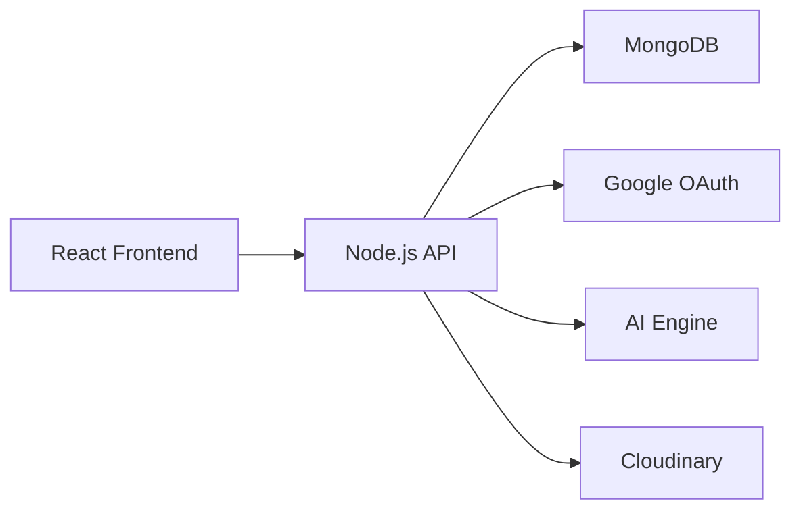

<div align="center">

# 🚀 TalentForge AI

### AI-Powered Interview Preparation Platform

Prepare Smarter • Practice Better • Get Hired Faster

<p align="center">
  <a href="https://your-demo-link.vercel.app">
    
  </a>
  <a href="#">
    
  </a>
  <a href="#">
    
  </a>
</p>

<p align="center">

TalentForge AI is an intelligent interview preparation platform that combines AI-powered mock interviews, resume analysis, DSA tracking, career guidance, and performance analytics into one modern SaaS experience.

</p>

</div>

---

## ✨ Why TalentForge?

Most interview preparation platforms focus on only one aspect.

TalentForge combines:

- 🤖 AI Interview Generation
- 📄 Resume ATS Analysis
- 🎤 Mock Interviews
- 💻 DSA Tracking
- 📊 Performance Analytics
- 🏆 Gamification
- 🧠 AI Career Assistant

All inside a single platform.

---

## 🖼 Preview

<p align="center">
  
</p>

---

## ⚡ Core Features

<table>
<tr>
<td width="50%">

### 🤖 AI Interview Generator

Generate role-specific interview questions powered by AI.

- Frontend
- Backend
- MERN
- Java
- React
- System Design

</td>

<td width="50%">

### 📄 Resume Analyzer

Upload your resume and receive:

- ATS Score
- Skill Analysis
- Missing Keywords
- Improvement Suggestions

</td>
</tr>

<tr>
<td width="50%">

### 🎤 Mock Interviews

Real interview simulation with:

- Timers
- Speech-to-Text
- Performance Tracking

</td>

<td width="50%">

### 📊 Analytics Dashboard

Track:

- Interview Scores
- DSA Progress
- Growth Trends
- Streaks

</td>
</tr>
</table>

---

## 🏗 Architecture



---

## 🛠 Tech Stack

### Frontend

- React.js
- Tailwind CSS
- Framer Motion
- React Router
- Axios
- Recharts

### Backend

- Node.js
- Express.js
- MongoDB
- JWT Authentication
- Google OAuth
- Cloudinary

### AI Layer

- OpenAI
- Gemini
- Groq

---

## 🚀 Getting Started

```bash
git clone https://github.com/Dev0ps404/TalentForge-AI.git

cd TalentForge-AI

npm install
```

### Run Frontend

```bash
cd client
npm run dev
```

### Run Backend

```bash
cd server
npm run dev
```

---

## 🌍 Deployment

| Service | Platform |
|----------|----------|
| Frontend | Vercel |
| Backend | Render |
| Database | MongoDB Atlas |
| Storage | Cloudinary |

---

## 📈 Roadmap

- [x] Resume Analysis
- [x] AI Mock Interviews
- [x] DSA Tracker
- [x] Google OAuth
- [x] Analytics Dashboard
- [ ] AI Voice Interviews
- [ ] Video Interview Evaluation
- [ ] AI Resume Builder

---

## 👨‍💻 Developer

**Devansh Agarwal**

GitHub: https://github.com/Dev0ps404

---

<div align="center">

### ⭐ If you like this project, consider starring the repository.

Built with ❤️ by Devansh Agarwal

</div>
